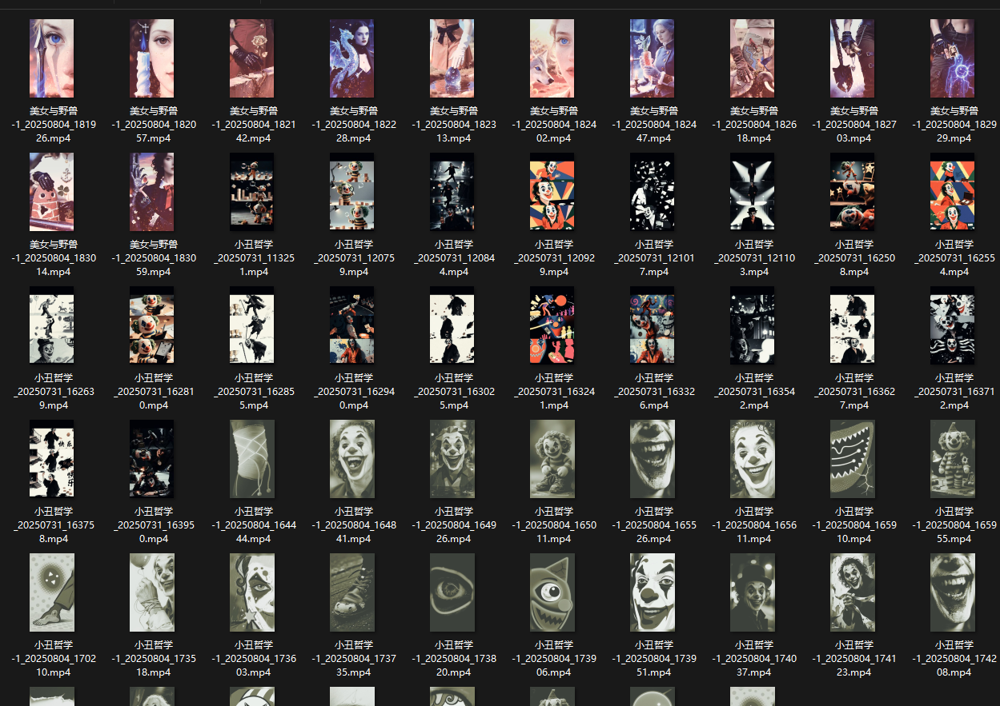

# JesterWisdom

一个基于AI的内容自动生成项目，用于生成幽默或吸引人的视觉内容。



## 项目介绍

本项目是一个自动化内容生成系统，可以根据Excel文件中的文本内容自动生成相关的图像内容。目前支持两种类型的内容生成：

1. 笑话/鸡汤内容生成（joke）
2. 吸引人的美女与怪兽图像生成（alluring）

项目使用AI图像生成技术，根据文本提示和参考图像创建垂直9:16比例的图像序列。

## 目录结构

```
JesterWisdom/
├── assets/                 # 资源文件目录
│   ├── joke/              # 笑话相关内容
│   │   ├── 鸡汤.xlsx       # 笑话文本数据
│   │   └── 小丑主体参考图*.png  # 图像生成参考图
│   └── alluring/          # 吸引人内容相关
│       ├── 生图提示词.xlsx    # 图像提示词数据
│       └── 美女主体参考图*.png  # 图像生成参考图
├── doubao/                 # 字节豆包相关功能模块
│   ├── __init__.py
│   ├── browser_utils.py
│   └── image_to_image.py
├── output/                 # 输出目录
├── asr.py                  # 语音识别相关功能
├── doubao_rpa.py           # 豆包RPA相关功能
└── main.py                 # 主程序入口
```

## 功能说明

### joke_run(is_image_gen=True, language='en')

生成笑话/鸡汤内容

- `is_image_gen`: 是否生成图像 (默认: True)
- `language`: 生成内容的语言 ('en' 为英文 或 'zh' 为中文)

该函数会根据 [鸡汤.xlsx](file:///D:/PycharmProjects/JesterWisdom/assets/joke/%E9%B8%A1%E6%B1%9F.xlsx)
中的内容生成一系列图像，图像内容与文本意境相关联。

### alluring_run(is_image_gen=True)

生成吸引人的美女与怪兽图像内容

- `is_image_gen`: 是否生成图像 (默认: True)

该函数会根据 [生图提示词.xlsx](file:///D:/PycharmProjects/JesterWisdom/assets/alluring/%E7%94%9F%E5%9B%BE%E6%8F%90%E7%A4%BA%E8%AF%8D.xlsx)
中的提示词生成美女与怪兽相关的图像序列。

## 使用方法

1. 确保已安装所需依赖项
2. 准备Excel数据文件和参考图像文件放入对应assets目录
3. 在 [main.py](file:///D:/PycharmProjects/JesterWisdom/main.py) 中配置运行参数
4. 运行 [main.py](file:///D:/PycharmProjects/JesterWisdom/main.py) 开始生成内容

```python
# 在 main.py 中选择运行模式
if __name__ == "__main__":
    is_image_gen = True
    # joke_run(is_image_gen, language='en')  # 生成笑话内容
    alluring_run(is_image_gen)  # 生成吸引人内容
```

## 输出说明

生成的文件将保存在 [output](file:///D:/PycharmProjects/JesterWisdom/output) 目录下，按照内容类型和行号进行组织：

- `output/joke/row_*/` - 笑话内容输出
- `output/alluring/row_*/` - 吸引人内容输出

每行数据会创建一个独立的文件夹，包含生成的相关文件。

## 技术细节

- 使用字节豆包AI进行图像生成
- 支持批量处理多条数据
- 自动生成输出目录组织文件
- 图像生成采用9:16竖屏比例，包含从全景到特写的镜头序列